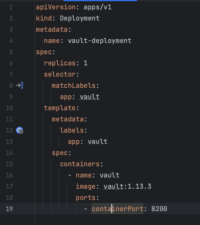

University: [ITMO University](https://itmo.ru/ru/)
Faculty: [FICT](https://fict.itmo.ru)
Course: [Introduction to distributed technologies](https://github.com/itmo-ict-faculty/introduction-to-distributed-technologies)
Year: 2023/2024
Group: K4110с
Author: Fofanov Maksim Gerbertovich
Lab: Lab1
Date of create: 28.09.2023
Date of finished: 31.09.2023

Разворачиваем minikube cluster:

Манифест для развертывания пода HashiCorp Vault:

Разворачиваем объект Deployment в кластере:

Загружаем Docker-образ "vault:1.13.3:

Создаем один временный Pod с именем "vault":

Создаем сервис для доступа к Pod с именем "vault":

Копируем root token из логов:

Настраиваем пересылку портов, что позволит обращаться к сервису Vault, работающему в кластере, через локальный порт 8200:

Заходим в vault по ссылке http://localhost:8200:

Авторизируемся в vault, с помощью root token:

Схема организации контейеров и сервисов:

Останавливаем minikube cluster:

Вывод:

1. Запустили локальный Kubernetes-кластер с помощью Minikube, используя Docker.

2. Развернули объект Deployment с именем "vault-deployment".

3. Загрузили Docker-образ "vault:1.13.3" из Docker Hub.

4. Создали временный Pod с именем "vault".

5. Создали сервис, который предоставляет доступ к Pod с именем "vault".

6. Настроили пересылку портов, что позволяет обращаться к сервису Vault через локальный порт 8200.
