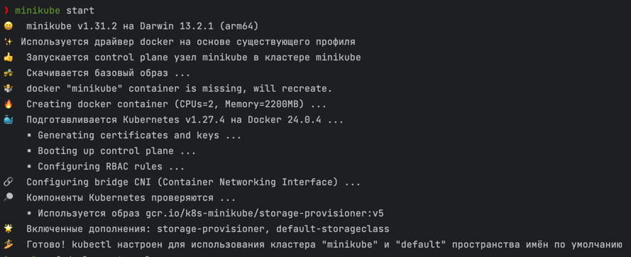

University: [ITMO University](https://itmo.ru/ru/)
Faculty: [FICT](https://fict.itmo.ru)
Course: [Introduction to distributed technologies](https://github.com/itmo-ict-faculty/introduction-to-distributed-technologies)
Year: 2023/2024
Group: K4110с
Author: Fofanov Maksim Gerbertovich
Lab: Lab2
Date of create: 28.10.2023
Date of finished: 31.10.2023

Разворачиваем minikube cluster:

Манифест, где Deployment с двумя репликами приложения и Service, 
который позволяет обращаться к этим репликам через NodePort на порту 3000 внутри кластера:

Запустим службу и деплоймент при помощи команды:

Проверяем состояние развернутых объектов Kubernetes. 
Видим, что деплоймент под названием my-app имеет 2 реплики, 
которые успешно работают, и сервис my-app типа NodePort.

Пробрасываем порт:

Открываем сервис my-app в браузере:

Останавливаем minikube cluster:

Схема организации контейеров и сервисов:

Вывод:

С помощью манифестов в данной работе была создана инфраструктура, включающая развертывание (Deployment) приложения с двумя репликами. При этом в переменные окружения контейнеров были переданы следующие значения:

REACT_APP_USERNAME было установлено равным "maxim_fofanov".

REACT_APP_COMPANY_NAME было установлено равным "ITMO".

Дополнительно, была создана служба (Service) типа NodePort, 
которая позволила перенаправлять входящий трафик в поды приложения. 
Это позволило нам доступать к приложению извне кластера.

Благодаря этой конфигурации смогли успешно развернуть приложение в Kubernetes, 
управлять им с двумя репликами и увидеть, как переданные переменные окружения ("maxim_fofanov" и "ITMO") доступны в разных контейнерах приложения.