University: [ITMO University](https://itmo.ru/ru/)
Faculty: [FICT](https://fict.itmo.ru)
Course: [Introduction to distributed technologies](https://github.com/itmo-ict-faculty/introduction-to-distributed-technologies)
Year: 2023/2024
Group: K4110с
Author: Fofanov Maksim Gerbertovich
Lab: Lab3
Date of create: 01.11.2023
Date of finished: 02.11.2023

Запускаем minikube cluster:

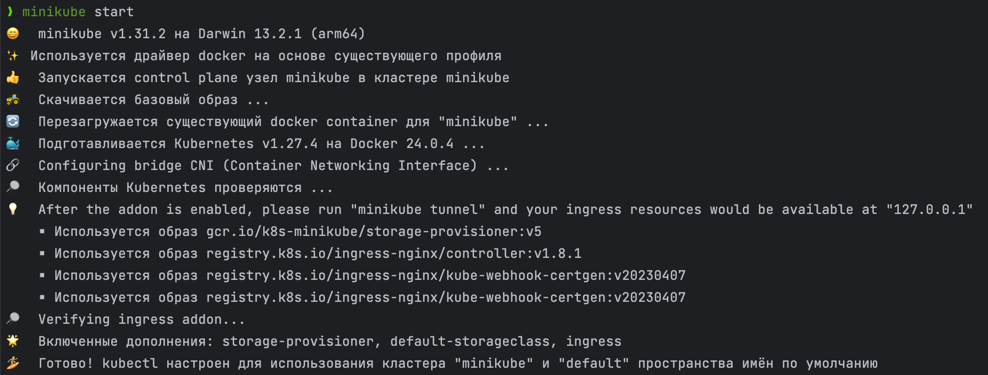

Опишем ConfigMap, через который мы будем передавать нужные переменные:

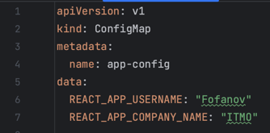

Опишем Deployment, который мы будем использовать вместо ReplicaSet:

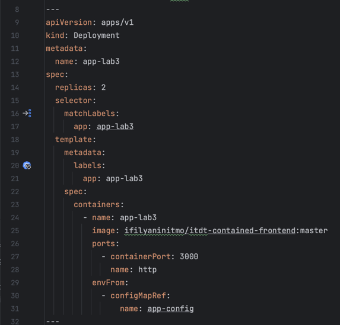

Опишем Service, через который будем получать доступ к подам:

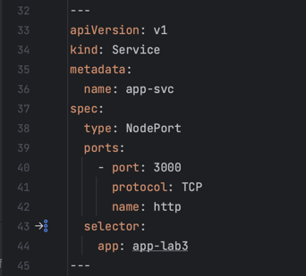

Опишем Ingress, через сущность будем обрабатывать внешние запросы к кластеру:

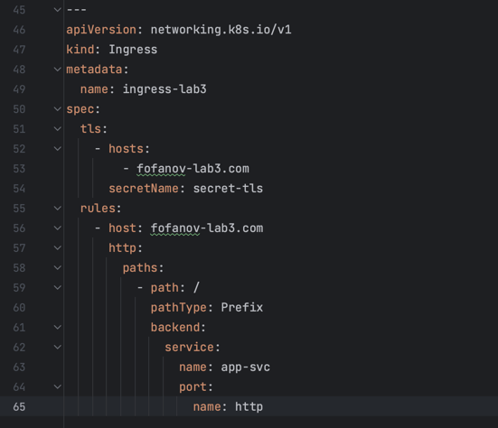

Включим minikube addons enable ingress:

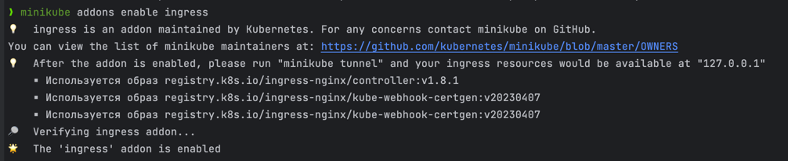

Применим конфигурацию:

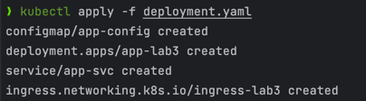

Сгенерируем TLS сертификат и импортируем сертификат в minikube:

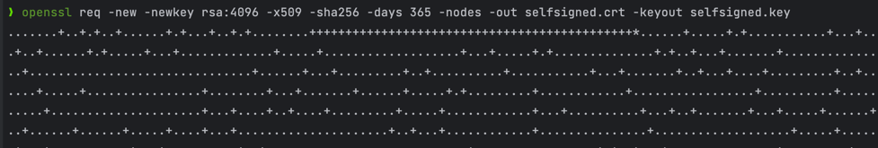

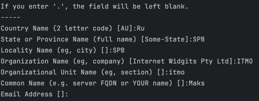

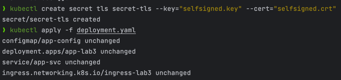

Добавим запись хоста в /etc/hosts:

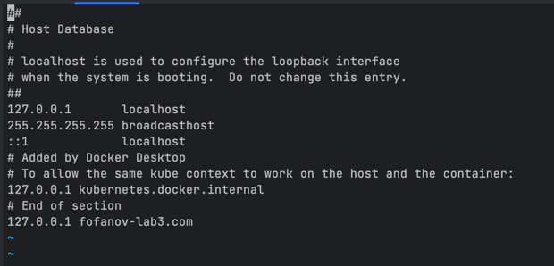

Используем команду minikube tunnel:

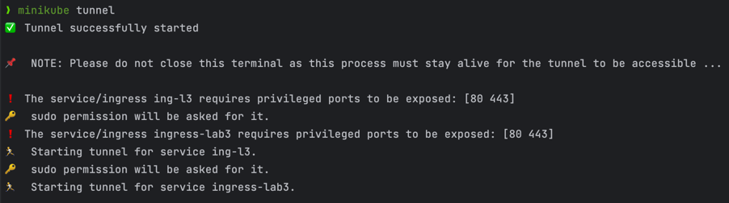

Переходим в браузер по fofanov-lab3.com:

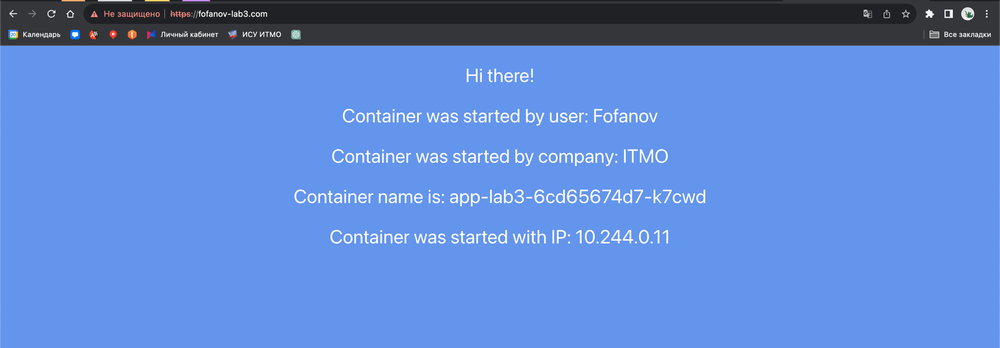

Проверяем сертификат: 

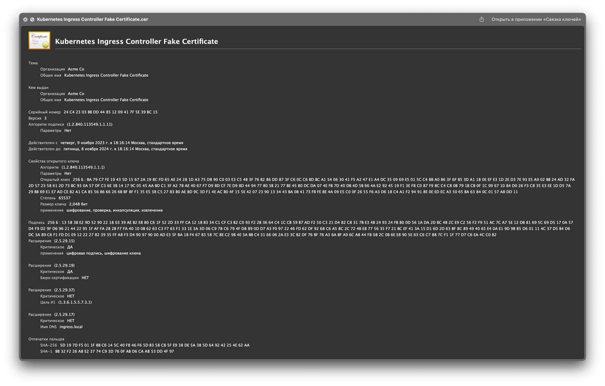

Диаграмма:

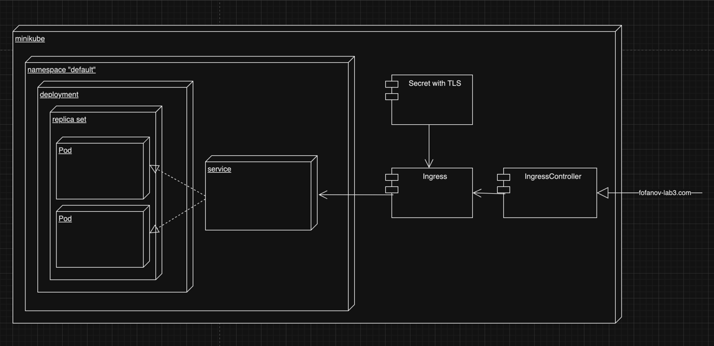

Останавливаем minikube cluster:

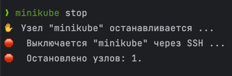