University: [ITMO University](https://itmo.ru/ru/)
Faculty: [FICT](https://fict.itmo.ru)
Course: [Introduction to distributed technologies](https://github.com/itmo-ict-faculty/introduction-to-distributed-technologies)
Year: 2023/2024
Group: K4110с
Author: Fofanov Maksim Gerbertovich
Lab: Lab3
Date of create: 04.11.2023
Date of finished: 05.11.2023

Запускаем minikube cluster:

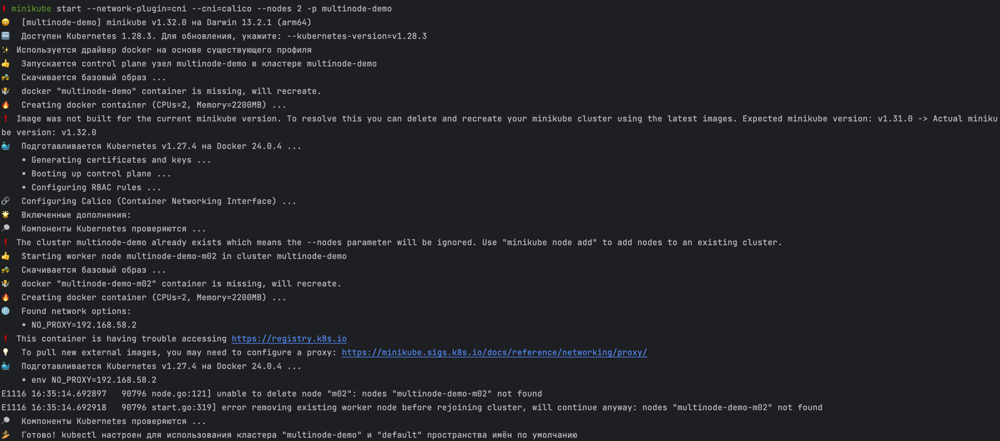

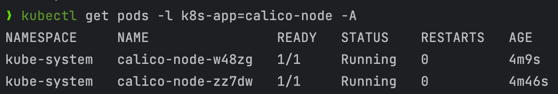

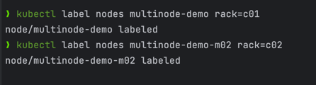

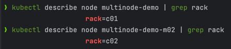

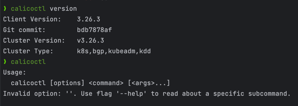

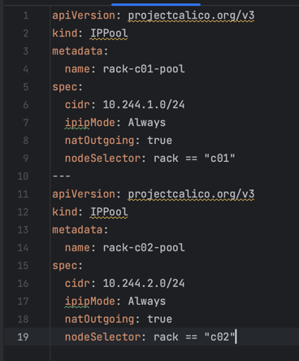

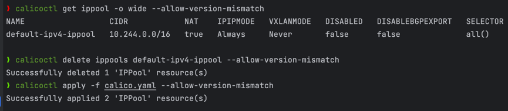

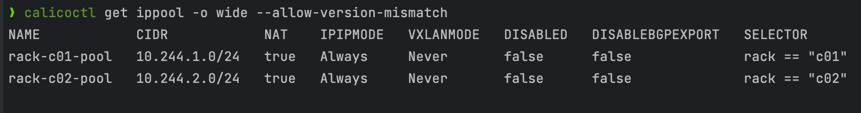

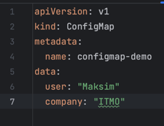

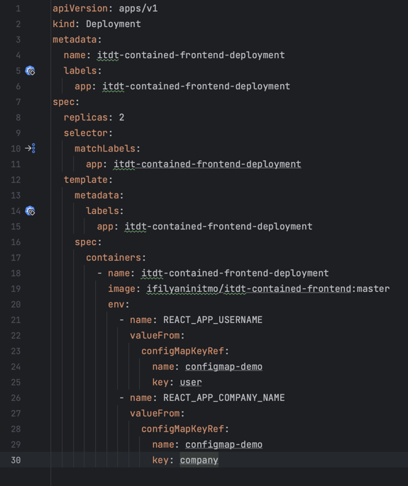

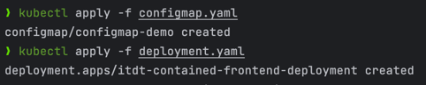

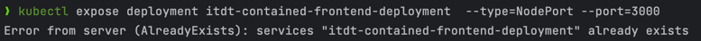

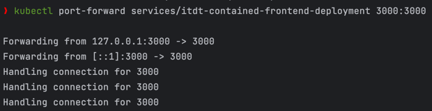

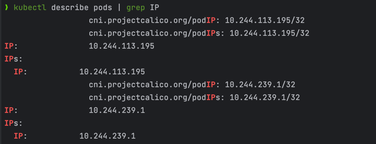

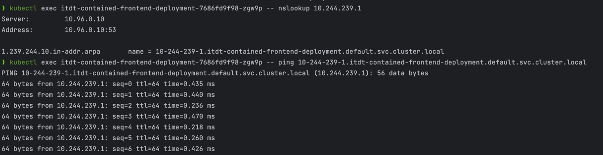

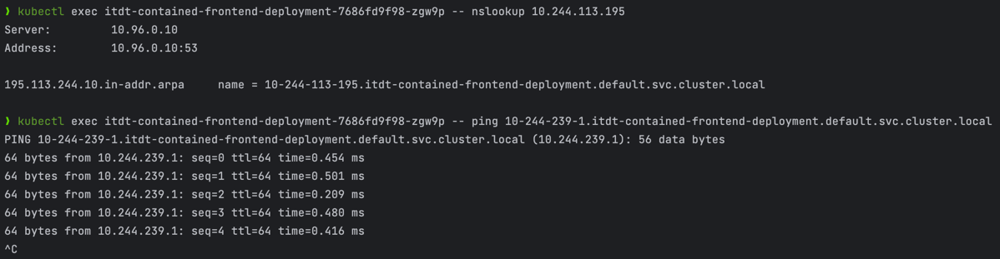

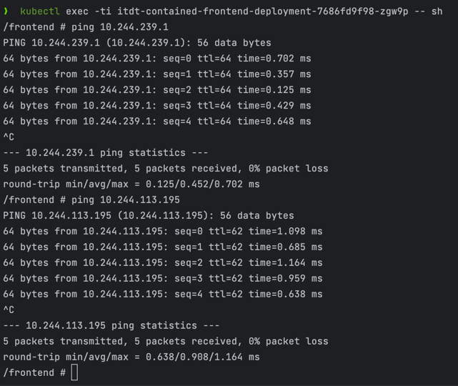

