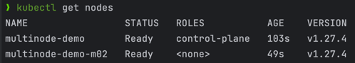
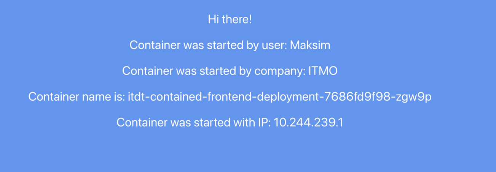

University: [ITMO University](https://itmo.ru/ru/)
Faculty: [FICT](https://fict.itmo.ru)
Course: [Introduction to distributed technologies](https://github.com/itmo-ict-faculty/introduction-to-distributed-technologies)
Year: 2023/2024
Group: K4110с
Author: Fofanov Maksim Gerbertovich
Lab: Lab4
Date of create: 04.11.2023
Date of finished: 05.11.2023

Запускаем кластер Minikube, указав сетевой плагин как Calico и два узла:

Проверяем статус узлов и подов Calico в кластере:

Присваиваем метки узлам, чтобы указать их соответствующим стойкам:

Проверяем метки узлов:

Проверяем версию Calico:

Создадаем манифест для выдачи диапазонов в соответствии с распределением нод по стойкам:

Проверяем что calico выдал диапазон по умолчанию. Удаляем его. Применяем манифест:

Сверяем новые диапазоны:

Создаем и запускаем configMap и deployment:

Создадем сервис для deployment:

Пробрасываем порт:

Переходим по http://127.0.0.1:3000/:

Получаем информацию о подах, и используем 'grep' для поиска IP-адресов подов:

Пингуем поды, с помощью FQDN нашего сервиса:

Второй способ:

Схема:

